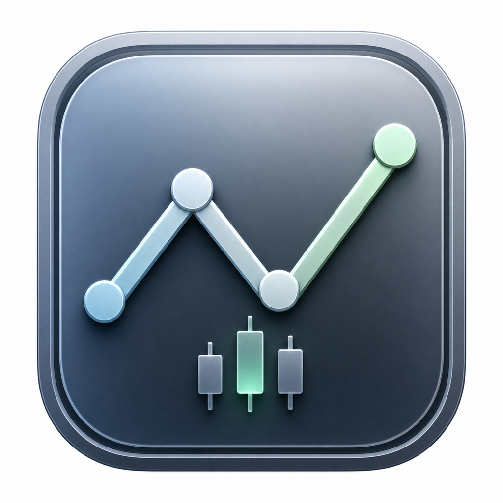
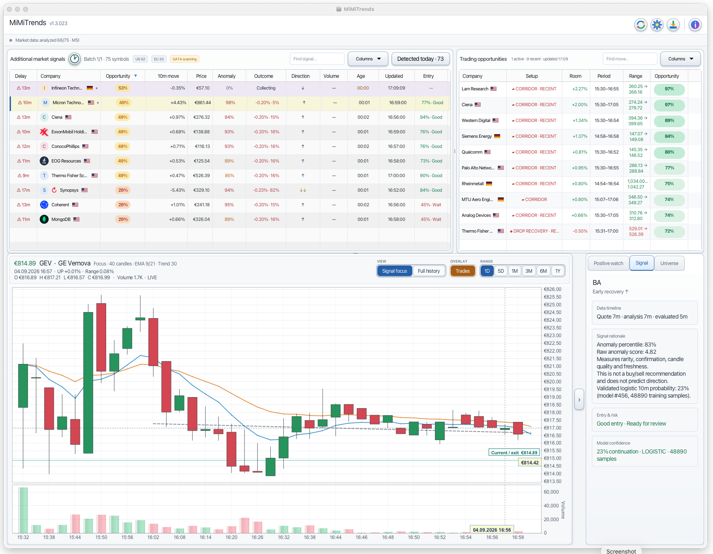
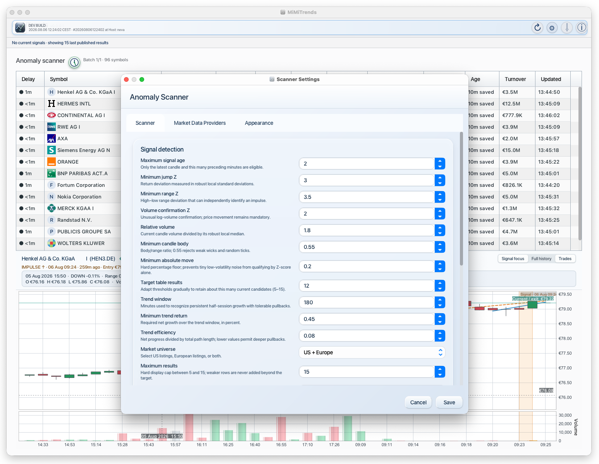
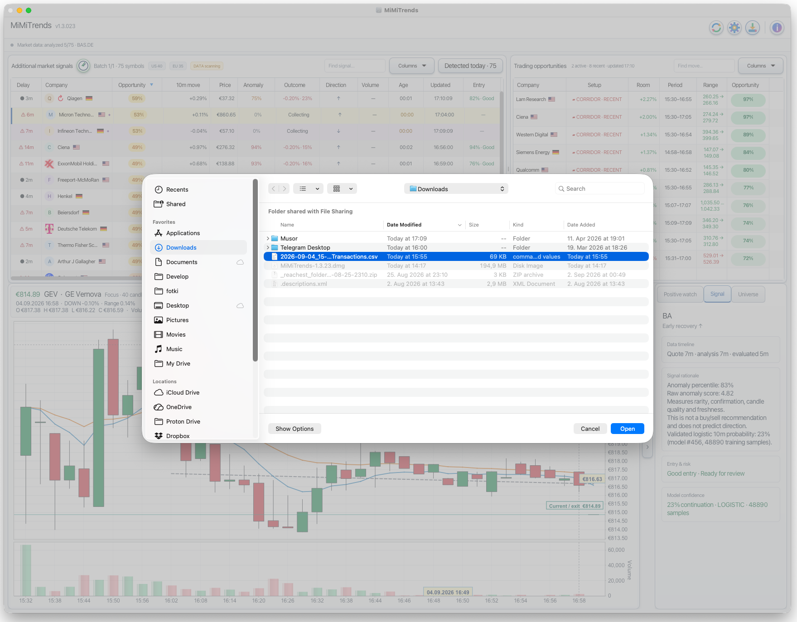
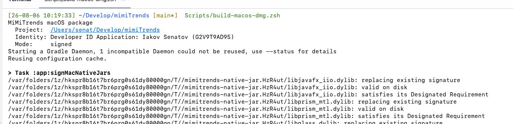

# MiMiTrends



**A local-first desktop scanner for fresh US and European market anomalies.**

MiMiTrends watches a configurable universe of US and European equities, detects unusual recent price activity, ranks the results, and explains why each instrument was selected. Adaptive selection drives the result set; configured thresholds are guardrails rather than a fixed checklist that leaves the table empty.

The application is written in Kotlin/JVM and JavaFX. It is designed as a cross-platform desktop application for macOS, Windows, and Linux. **The current builds and user interface have so far been tested only on macOS.** Windows and Linux packaging is implemented, but those distributions should be treated as unverified until they receive platform-specific testing.

MiMiTrends is informational software. It does not place orders, provide investment advice, or guarantee that a detected anomaly will continue.

## At a glance

### Scanner and signal chart



*Freshness is the first sortable column. The scanner combines current signals with the latest useful
published context, while the lower pane shows the selected event, minute candles, volume, entry,
current price, and the exact OHLCV value beneath the cursor.*

### Scanner settings



*Detection, trend, universe, provider, and appearance controls are grouped in one settings window.
Each analytical field includes a short explanation of what it changes.*

### Broker CSV import



*The import action accepts a Scalable Capital transaction export. Imported executions can be shown
on the corresponding price chart without sending portfolio or transaction data to a remote service.*

## Quick start

```bash
git clone https://github.com/senatov/mimiTrends.git
cd mimiTrends
./gradlew run
```

Open **Settings**, choose the market universe, and allow the first history bootstrap and scan to
complete. Select any table row to inspect its chart. No API key is required for the default data
path; Finnhub is an optional enhancement for supported US symbols.

## Why it exists

Traditional charts are useful for studying price history, but they often require the user to inspect many instruments manually. MiMiTrends reverses that workflow:

1. collect and normalize recent market data;
2. compare the latest completed candles with the instrument's own historical behavior;
3. reject ordinary movement and unconfirmed volume spikes;
4. rank only fresh, statistically unusual candidates;
5. show the signal, its strength, entry context, volume confirmation, and subsequent movement.

The primary question is not “What did this stock do over the last year?” but “What unusual event is happening now, how strong is it, and is the move being confirmed?”

## What the application does

- scans US, European, or combined watchlists;
- detects fresh upward and downward one-minute impulses;
- requires an exceptional price move or candle range, not volume alone;
- confirms candidates using candle structure, relative volume, log-volume anomaly, or immediate continuation;
- applies a configurable minimum absolute move so tiny changes in quiet stocks do not become misleading signals;
- supplements a sparse strict result set with relaxed impulses and persistent rising trends;
- adapts thresholds to retain the strongest defensible candidates instead of treating the configured
  target as a mandatory quota;
- ranks completed results atomically instead of changing the visible table while a scan is running;
- retains recently published events for up to twenty minutes after they stop qualifying, labels them as
  `Cooling`, and decays their ranking score while always giving active signals priority;
- rechecks published `Strong` and `Extreme` signals every minute in a separate priority task, updating
  their rows immediately and stopping when they fall below `Strong`;
- stores minute OHLCV history, company profiles, derived statistics, scan runs, and signal outcomes in SQLite;
- corrects stale European snapshots with timestamped observations from Tradegate, Euronext,
  Börse.de, BNP Paribas, Lang & Schwarz, and TraderFox where an instrument can be resolved safely;
- never labels a crawled quote as fresh using its HTTP download time: the provider's own observation
  timestamp is required;
- uses exchange-local time zones and market calendars for US, Xetra, Euronext, and Helsinki instruments;
- pauses scanning while every selected market is closed and resumes after the earliest next opening;
- displays quote age in the leading `Delay` column and sorts it numerically, distinguishing current
  observations from stale ones without hiding delayed-but-useful European candidates;
- provides a signal-focused chart with a full-history fallback;
- imports Scalable Capital transaction CSV files and outlines each matching trade interval on the
  chart with a translucent orange highlighter-style frame;
- remembers window geometry, divider position, table appearance, columns, and the selected instrument.

## Reading the scanner table

The primary table intentionally uses plain-language categories instead of exposing every raw statistical value.
It distinguishes active signals from recent context: a `Cooling` row records a signal that was published
recently but no longer passes the current detector. It is not presented as a continuing impulse and expires
automatically. A rapid opposite V-reversal updates the same visible episode instead of silently erasing it.

| Column | Meaning |
| --- | --- |
| Delay | Age of the latest provider observation. It is numeric and sortable; the icon distinguishes a current quote from a stale one. |
| Symbol | Instrument identity and cached company profile. The context menu copies either the ticker or a short search-friendly company name. |
| Pattern | Detected fresh impulse, relaxed impulse, or persistent trend. It describes observed price action rather than recommending a trade. |
| Move 10m | Signed price change over the latest ten-minute display window. |
| Price | Latest completed locally available price in the selected display currency. |
| Anomaly | Composite anomaly ranking: `Low`, `Moderate`, `High`, or `Very high`. This measures how unusual and well-confirmed the detected move is; it is not a buy/sell recommendation or a prediction that the move will continue. |
| Outcome | Median directional return after 0.20% estimated friction and the empirically profitable share, such as `+0.08% · 58%`. The tooltip includes the middle 50% range, a 95% uncertainty interval, sample count, and favorable/adverse excursions. |
| Price action | Human-readable interpretation such as `Rare impulse ↑`, `Steady trend ↑`, or `Volatile / unstable`. Rare impulses receive a dark-green outline. |
| Volume | `Normal`, `Elevated`, `Strong`, `Extreme`, or `Price-led`, with relative volume when available. |
| Age | Signal window or retained publication age; this is separate from quote freshness. |
| Turnover | Approximate current-session traded value. |
| Updated | Provider observation time rendered in the user's local time zone. |

Hovering the derived columns reveals the exact jump, range, volume Z-scores, RVOL, composite score, and an explanation of the classification. This keeps the normal workflow readable without discarding analytical detail.

## Statistical model

MiMiTrends evaluates completed, minute-aligned OHLCV bars. Bars with non-finite values, impossible OHLC relationships, negative volume, invalid prices, or malformed timestamps are excluded. A valid zero-volume bar may remain in the price series; positive historical volume is still required when constructing a relative-volume reference.

The scanner also recognizes fresh V-shaped reversals across two- to six-minute shock windows. It requires a statistically unusual shock of at least 0.25%, a recovery of at least 0.20%, directional efficiency on both sides of the turn, two confirming recovery steps, sufficient recovery velocity, and limited lingering near the extreme. Scoring combines time-matched shock rarity, reclaimed depth, fall/recovery speed, path quality, and freshness. The extreme expires after nine minutes, so an unrecovered fall, slow weak bounce, repeatedly tested bottom, or old inactive reversal is not promoted as a current opportunity.

Clean staircase-like growth is ranked separately as `Steady rise ↑`. The detector evaluates 10- to 180-minute windows and requires a meaningful return, regression fit, directional efficiency, a majority of non-negative minute steps, bounded drawdown, and positive continuation during the latest five minutes. Once an hour of session data exists, the 60-minute return and regression slope must also be positive, preventing a clean short bounce inside an established decline from being mislabeled as sustained growth. Short 10- and 15-minute windows still allow unusually clean opening trends to qualify before an hour of context exists.

A slightly negative three-minute tail does not immediately invalidate an otherwise continuing rise. It is
accepted only when the pullback is no larger than 0.05% and remains below the average absolute minute move
of the selected trend window. This reduces signal flicker from ordinary noise without retaining a material
short-term reversal.

### Comparable baseline

For a candidate candle, the scanner prefers historical candles from prior sessions within approximately ±15 minutes of the same exchange-local time. This matters because volatility and volume near an opening auction are not comparable with quiet midday trading.

The default baseline uses five sessions and requires enough samples to avoid unstable estimates. If comparable time-of-day history is still too short, the scanner falls back to a larger recent sample.

Sessions are calculated in the instrument's exchange time zone:

- US listings: `America/New_York`;
- Xetra and most continental European listings: Central European time;
- Helsinki listings: `Europe/Helsinki`.

### Robust Z-scores

Ordinary mean and standard deviation are easily distorted by the same outliers the scanner is trying to detect. MiMiTrends therefore uses the median and median absolute deviation (MAD).

For observations `x`:

```text
center = median(x)
robust scale = 1.4826 × median(|x - center|)
```

A small floor prevents near-zero historical variation from producing infinite or absurd scores.

The impulse model calculates:

- **Jump Z** — absolute close-to-close return deviation from the robust baseline;
- **Range Z** — excess high–low range relative to the normal candle range;
- **Volume Z** — positive anomaly in `log(1 + volume)`;
- **RVOL** — candidate volume divided by the median positive baseline volume;
- **body ratio** — absolute candle body divided by its high–low range;
- **close location** — where the close lies inside the candle range.

These technical values are persisted and remain available in tooltips, while the table converts them into plain-language price-action and volume labels.
Volume quality is stored with every minute bar as `REPORTED`, `ZERO`, `MISSING`, or `ESTIMATED`. Missing, zero, and partial volume remains visible but receives no statistical confirmation and is excluded from volume baselines.

### Impulse qualification

A candle is eligible only when all of the following are true:

1. the signal is inside the configured freshness horizon;
2. Jump Z or Range Z crosses its threshold;
3. the absolute price move crosses the economic minimum;
4. the close is directional rather than buried in a long opposing wick;
5. the move is confirmed by volume, body quality, or same-direction continuation.

Volume cannot independently promote a quiet instrument.

The default strict thresholds are:

```text
Jump Z             3.0
Range Z            3.5
Volume Z           2.0
Relative volume    1.8×
Body ratio          0.55
Absolute move       0.20%
Maximum age         2 minutes
```

All user-facing thresholds can be adjusted in Settings.

### Additional public providers

European coverage is corrected by independent provider adapters rather than by overwriting the Yahoo series.
Tradegate and Euronext can be enabled and paced in Settings. The table-result refresher additionally uses
Börse.de, BNP Paribas, Lang & Schwarz, and TraderFox for resolvable ISINs or WKNs. Lang & Schwarz reads its
Europe and Euro Stoxx tables in one bounded pass; the other crawlers rotate selected symbols sequentially.

Every provider observation is stored in its own series with provider, identifier, MIC, currency, and original
observation time. A quote without an unambiguous provider timestamp is rejected. Newer observations can extend
the latest analytical tail and refresh a published row, while older responses cannot replace fresh GUI or
database state. Snapshot-only sources have `MISSING` volume quality and therefore cannot manufacture volume
confirmation.

These are public website integrations rather than contracted APIs and can change without notice. Failures are
isolated per provider, logged without cookies or credentials, and do not stop the rest of the scan.

### Early three-minute momentum

The scanner also evaluates the latest three consecutive completed candles as one directional move.
This catches a rapid rise or fall before any individual minute crosses the ordinary absolute-move threshold.
The three-minute move must exceed 0.35%, remain at least 65% directionally efficient, continue in the latest
minute, and be statistically unusual against comparable three-minute windows from prior sessions. Its score
uses the same robust price and volume scale as an ordinary impulse. Because only the latest three candles are
eligible, the signal disappears automatically when acceleration stops; a flat ten-minute tail cannot remain
an active momentum signal.

### Range and chop rejection

Fresh impulses, momentum, and reversals are checked against the preceding fifteen-minute price regime. A
window is treated as range-bound when net displacement is small relative to the total travelled path and
price repeatedly alternates direction. A candidate that remains inside that established high/low range is
rejected. A close beyond the range with a small confirmation buffer is retained as a possible breakout. This
prevents ordinary oscillation around a mean from being promoted while preserving genuine exits from
consolidation.

### Composite score

The raw impulse score gives most of its weight to the stronger price anomaly, then adds volume confirmation and immediate continuation:

```text
raw = 0.65 × max(Jump Z, 0.8 × Range Z)
    + 0.25 × Volume Z
    + 0.10 × continuation
```

The result is multiplied by candle quality and exponential freshness decay. Consequently, a structurally clean current impulse ranks above an old or wick-heavy event with similar raw Z-scores.

### Relaxed impulses and trend fallback

If strict impulses do not fill the configured minimum result count, MiMiTrends may add:

- **relaxed impulses**, using moderately lower statistical confirmation thresholds while retaining freshness and the absolute-move floor;
- **persistent trends**, which do not depend on one exceptional candle.

The trend fallback evaluates up to 180 minutes of the current session. It requires positive net return, a positive least-squares slope, sufficient R², an efficiency ratio above the configured minimum, and continued growth over the latest ten and five minutes.

Trend efficiency is:

```text
net progress / total travelled price path
```

This allows reasonable pullbacks while rejecting a noisy sideways chart that merely ends slightly above its starting point.

## Signal outcomes

Published signals are evaluated later at target horizons of 5, 10, and 30 minutes. Outcome returns use the exact signal candle price and timestamp rather than the later scan-completion price.

The scanner's `Outcome` column uses independent ten-minute episodes. Repeated publications for the same
symbol and signal family within fifteen minutes count as one episode. Directional returns are reduced by a
conservative 0.20% friction allowance before profitability is assessed, so a negligible move is not counted
as a useful continuation. The displayed probability uses mild beta smoothing, while its uncertainty range is
a 95% Wilson interval. A minimum of twelve independent episodes, five symbols, and three trading days is
required before the metric is displayed.

Calibration is walk-forward: a signal can use only outcomes recorded before its own signal time. When enough
history exists, the first estimate is restricted to a comparable cohort by market region, strict versus
relaxed detection, and realtime versus non-realtime feed quality. A broader signal-family estimate is used
only while that cohort is too small. Detector scores are converted to a 0–10 historical percentile after at
least thirty prior observations from the same signal family and direction, making unlike detectors safer to
rank in one table.

Adaptive selection is a quality ceiling, not a row quota. It may relax detector criteria gradually, but it
will not fill the requested table size with candidates below the stricter of the absolute score floor and
the current market-relative score floor.

Before publication, every result passes an additional attention-quality gate. Current impulses require a
meaningful market-specific move, strong price or range deviation, a directional candle body, and either
volume confirmation or exceptional price evidence when volume is unavailable. Signals older than two
minutes and cooling context never qualify as current candidates. Trend candidates need at least a 30-minute
window, 0.80% progress, and sufficient path efficiency. Calibrated adaptive results must rank at or above the
80th historical percentile, and at most two adaptive rows may be published in one scan. Consequently, the
table may legitimately contain fewer rows than the configured target.

While an episode is active, observed candle highs and lows update its maximum favorable excursion (MFE) and
maximum adverse excursion (MAE). These path metrics describe typical opportunity and drawdown after a signal;
older outcomes created before this schema was introduced remain usable but have no excursion values.

The database stores both the target horizon and the actual elapsed time. This avoids silently treating a delayed observation as an exact five-minute result. Outcome collection accepts only a small scheduling delay and records:

- signal entry price;
- observed price;
- target horizon;
- actual elapsed minutes;
- realized percentage return;
- maximum favorable and adverse movement observed before the horizon;
- observation timestamp.

This apparatus is intended for later empirical work: measuring continuation rates, evaluating thresholds, comparing signal classes, and detecting whether an apparently strong score has predictive value. The application does not yet present these records as a backtest or claim a validated trading edge.

## Market data

### Yahoo Finance

Yahoo Finance is the default history and fallback provider and does not require an API key. The application bootstraps recent minute history, then requests and upserts the missing tail. Yahoo's public chart endpoint is not a contracted API and may change without notice.

Corrective provider quotes may refresh the displayed current price, but an isolated quote is never treated as
a minute-bar pattern. A provider tail needs at least five continuous recent minutes before it can extend the
series used by the detectors. Freshness validation likewise follows the analytical series, so a current
snapshot cannot disguise stale candle history.

European quotes may be delayed. MiMiTrends labels data as live, delayed, Yahoo, or cached rather than assuming that every last bar is current.

### European quote correction

Timestamped public observations from Tradegate, Euronext, Börse.de, BNP Paribas, Lang & Schwarz,
and TraderFox can correct the visible tail of European instruments. The leading `Delay` value is
calculated from the quote timestamp, not from the moment MiMiTrends downloaded the page. A provider
that returns an old quote therefore remains visibly stale and cannot displace a newer observation.

### Finnhub

Finnhub is optional. With a user-provided API key, one WebSocket connection subscribes to selected US symbols and aggregates trades into minute OHLCV bars. Finnhub also acts as a company-profile and logo fallback.

Configure the key in **Settings → Finnhub live feed**, through `FINNHUB_API_KEY`, or through an ignored project `.env` file. The final local fallback is:

```text
~/.mimi/trends/finnhub.properties
```

Never commit credentials. Provider availability and exchange coverage depend on the user's account and licensing.

## Market calendar and closed-market behavior

The scheduler uses exchange-local clocks, weekdays, daylight-saving rules, and local holiday calendars. It distinguishes regular US, Xetra, Euronext, and Helsinki sessions.

If none of the selected instruments is currently tradable, MiMiTrends:

1. stops issuing provider scans;
2. restores the most recent published snapshot when available;
3. clearly marks the rows as saved or cached, not live;
4. calculates the earliest next opening among the selected markets;
5. displays the resume time in the user's local time zone;
6. schedules one wake-up shortly after that opening.

The calendar is local and deterministic, so ordinary closed-market behavior does not depend on an external calendar service. Future or exceptional exchange closures can still require a software calendar update.

## Signal-focused chart

Selecting a scanner row opens its locally stored candles and volume.

`Signal focus` is the default mode. It shows a limited context before the signal instead of compressing several days of history into hundreds of unreadable candles. The chart includes:

- full company name and ticker;
- current locally available price;
- signal type, time, entry price, current/exit reference, score, and RVOL;
- a non-linear trading-time axis that removes closed-market gaps and reserves at least one third of the width for fresh signal candles;
- aggregated distant context with unaggregated minute candles around the signal;
- fast 5-minute and local 15-minute direction overlays;
- a highlighted signal interval and signal-volume bar;
- real OHLC, candle return, and volume for the candle nearest the cursor;
- stronger background grid lines for accurate visual comparison;
- a `Full history` switch for broader context;
- pan, zoom, synchronized time/price cursors, and tooltips.

Switching instruments resets all chart ranges after datasets, signal markers, and trade overlays are
installed. This prevents a high-priced instrument from leaving an unusable price scale on the next chart.

The chart deliberately does not connect separate trading sessions with a continuous close-price line, because such diagonals can suggest price movement during periods when no trading occurred.

## SQLite database and analytics

All durable state is stored locally in:

```text
~/.mimi/trends/mimitrends.db
```

SQLite runs in WAL mode with foreign keys enabled, a busy timeout, batched prepared statements, and transactional schema migrations. It is a good fit for the application's local, append/upsert-heavy workload and avoids the lifecycle overhead of an ORM.

`MarketRepository` owns operational minute bars and company profiles. `AnalyticsRepository` owns derived and historical analytics. Both use the same database but keep their responsibilities explicit.

### Operational tables

| Table | Purpose |
| --- | --- |
| `minute_bars` | Unique minute OHLCV rows keyed by symbol and timestamp. |
| `company_profiles` | Company name, exchange, logo URL, and cached image. |

Minute bars use UPSERT semantics, allowing an incomplete or repeated provider candle to be corrected without creating duplicates.

### Analytical tables

| Table | Purpose |
| --- | --- |
| `schema_migrations` | Transactionally applied schema versions. |
| `instrument_metadata` | Name, exchange, currency, time zone, aliases, and tradability. |
| `corporate_actions` | Splits and dividends available for validation and future normalization. |
| `market_calendar_rules` | Regular exchange hours and time zones. |
| `trading_sessions` | Observed session boundaries, bar coverage, volume, and turnover. |
| `fx_rates` | Dated currency conversion rates. |
| `data_quality` | Feed source, freshness, bar count, status, and diagnostics. |
| `aggregate_bars` | Locally produced 5-, 15-, and 60-minute OHLCV. |
| `baseline_stats` | Median/MAD return and log-volume by instrument and local time of day. |
| `scan_runs` | One durable record for every scanner pass. |
| `scan_candidates` | Accepted/rejected symbols, raw metrics, exact signal time and entry price, source, and publication state. |
| `signal_outcomes` | Target and actual horizons, observed price, and realized return. |
| `provider_instruments` | Persisted provider-specific symbol-to-ISIN mappings, MIC, currency, and resolved name. |
| `provider_minute_bars` | Venue-specific observations with provider, ISIN, MIC, currency, and monotonic observation time. |
| `provider_quotes` | Latest provider bid/ask, sizes, session totals, average, executions, range, and previous close. |
| `broker_transactions` | Locally imported broker executions used for chart overlays and trade context. |

Candidate publication and scan completion occur in one transaction. This prevents a partially completed scan from appearing published. Foreign keys and cascading retention protect referential consistency.

### Retention

- raw minute bars: 90 days;
- 5/15/60-minute aggregates: 730 days;
- scan runs, candidates, and quality records: 180 days;
- instrument metadata, corporate actions, observed sessions, FX rates, baselines, and outcomes: retained.

More detail is available in [Analytics storage](Doc/AnalyticsStorage.md).

## Project structure

```text
core/         Domain models, market time-zone resolution, OHLCV validation, logging tags
database/     SQLite cache, analytics repository, migrations, aggregation, outcome storage
market-data/  Yahoo and provider-specific HTTP clients, parsers, and response mapping
scanner/      Impulse/trend statistics, market calendar, scanner settings
charts/       Reusable JFreeChart-FX candlestick and volume component
finnhub-ws/   Optional Finnhub WebSocket client, profiles, and minute aggregation
app/          JavaFX lifecycle, dialogs, presentation, state, and orchestration
Doc/          Architecture notes, packaging instructions, and documentation assets
Scripts/      Native packaging helpers
```

The dependency direction keeps UI code out of the data, scanner, and chart modules. Statistical and persistence behavior can therefore be tested without starting JavaFX.

## Requirements

- Git;
- a JDK compatible with the configured Gradle toolchain, or permission for Gradle/Foojay to resolve it;
- network access for first-time dependency resolution and provider requests.

The Gradle wrapper is included.

## Build and run

macOS or Linux:

```bash
./gradlew run
./gradlew test
./gradlew check
./gradlew build
```

Windows:

```bat
gradlew.bat run
gradlew.bat test
gradlew.bat check
gradlew.bat build
```

In IntelliJ IDEA, import the repository root as a Gradle project and use the shared `MiMiTrends [run]` configuration. The application entry point is:

```text
org.senatov.mimitrends.LauncherKt
```

## Using the application

1. Start MiMiTrends.
2. Open Settings and select the US, European, or combined region.
3. Adjust the watchlist, scan interval, freshness, liquidity, and statistical thresholds if needed.
4. Optionally configure a Finnhub API key.
5. Wait for the initial historical bootstrap and completed scan.
6. Sort by `Delay` to inspect freshness, or by anomaly, price action, volume, and ten-minute move.
7. Hover derived cells to inspect the exact statistical values.
8. Select a row to open its signal-focused chart.
9. Move the cursor across the chart to inspect candle OHLCV values.
10. Switch to `Full history` only when broader context is needed.

Settings and UI state are stored beside the database under:

```text
~/.mimi/trends/
```

## Native desktop packages

Native packages contain a private runtime, so end users do not need to install a JDK. `jpackage` must run on the target operating system; the project does not cross-build native formats.

### macOS

Run the packaging script from the repository root to create a complete self-contained DMG. The
package includes MiMiTrends and its private Java runtime, so the destination Mac does not need a
separate JDK installation.

```bash
./Scripts/build-macos-dmg.zsh
```



The script requires Xcode Command Line Tools and a `Developer ID Application` certificate in the
login Keychain. It automatically selects the first matching certificate, signs the application and
embedded native libraries, builds the DMG, verifies it, and prints its location and SHA-256 hash.
Use an explicit identity when more than one suitable certificate is installed:

```bash
./Scripts/build-macos-dmg.zsh --identity "Your Name (TEAMID)"
```

For a public release, first store App Store Connect credentials in a Keychain profile as described
in [Native packaging](Doc/NativePackaging.md), then run the complete notarization workflow:

```bash
./Scripts/build-macos-dmg.zsh --notarize
```

The notarized form uses the `MiMiNotary` keychain profile by default; override it with `--profile`.
Apple explains the distribution requirements in
[Notarizing macOS software before distribution](https://developer.apple.com/documentation/security/notarizing-macos-software-before-distribution)
and its current command-line workflow in
[TN3147: Migrating to the latest notarization tool](https://developer.apple.com/documentation/technotes/tn3147-migrating-to-the-latest-notarization-tool).

For a local unsigned `.app` image instead of a distributable DMG, run:

```bash
./gradlew :app:packageMacApp
```

### Windows

Run the following command from a Windows Command Prompt:

```bat
Scripts\build-windows-exe.bat
```

The script creates a self-contained EXE installer and prints its location and SHA-256 hash. It
requires a JDK, WiX Toolset 3.x, and the WiX `candle.exe` and `light.exe` commands on `PATH`.
For public distribution, sign and timestamp the resulting installer with a trusted code-signing
certificate and verify its signature. See Microsoft's
[SignTool documentation](https://learn.microsoft.com/en-us/windows/win32/seccrypto/signtool)
and Oracle's
[jpackage packaging prerequisites](https://docs.oracle.com/en/java/javase/17/jpackage/packaging-overview.html).

This Windows packaging workflow has not been tested because I do not have a Windows system 😞

### Linux

Run the packaging script on Linux:

```bash
./Scripts/build-linux-packages.sh
./Scripts/build-linux-packages.sh --portable-only
./Scripts/build-linux-packages.sh --deb-only
```

The default command creates both a portable self-contained `.tar.gz` archive and a Debian/Ubuntu
`.deb` package. Use either option to build only one format. A JDK and `sha256sum` are required;
building the Debian package additionally requires `fakeroot` and `dpkg-deb`. Inspect the `.deb`
with `dpkg-deb --info` and `dpkg-deb --contents`, then install it on a disposable test system before
distribution. See Oracle's
[jpackage packaging prerequisites](https://docs.oracle.com/en/java/javase/17/jpackage/packaging-overview.html)
and the official Debian documentation for
[`dpkg-deb`](https://www.debian.org/doc/manuals/debian-faq/pkgtools.en.html#dpkg-deb).

This Linux packaging workflow has not been tested because I do not have a Linux system 😞

Outputs are written below:

```text
app/build/distributions/native/
```

See [Native packaging](Doc/NativePackaging.md) for signing, notarization, prerequisites, and output details.

## Logging and diagnostics

MiMiTrends uses SLF4J and Log4j2. Logs are written to the run console and the rolling file:

```text
/tmp/MiMiTrends.log
```

The default `INFO` level records lifecycle events, scan summaries, warnings, and failures without per-tick noise. Enable temporary detail with:

```bash
JAVA_TOOL_OPTIONS="-Dmimitrends.logLevel=DEBUG" ./gradlew run
```

The status bar reports the current operation. A red details button opens the complete error report. Credentials are not intentionally logged.

## Technology

- Kotlin/JVM;
- JavaFX 26;
- JFreeChart and JFreeChart-FX;
- SQLite JDBC;
- Gradle Kotlin DSL;
- SLF4J and Log4j2;
- JUnit 5 and Kotlin Test;
- `jpackage` for native desktop distributions.

## Platform status

| Platform | Packaging | Current validation status |
| --- | --- | --- |
| macOS | `.app`, signed/notarized DMG | Implemented and tested. |
| Windows | Self-contained EXE installer | Implemented, not yet tested locally 😞 |
| Linux | Portable archive and Debian package | Implemented, not yet tested locally 😞 |

The codebase and dependency selection are cross-platform, but platform-specific testing is still required before claiming production support outside macOS.

## License and third-party components

JFreeChart and JFreeChart-FX are LGPL libraries. Review their upstream license terms when redistributing the application. Provider data remains subject to the respective provider and exchange terms.
